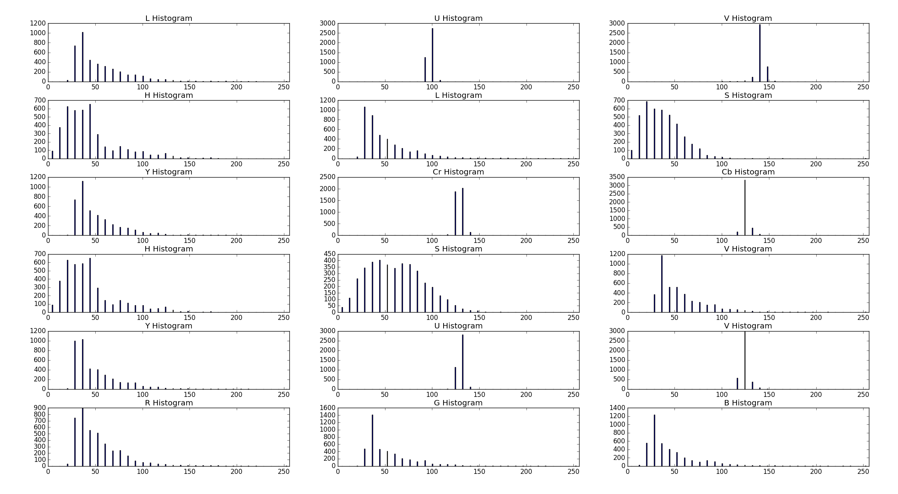
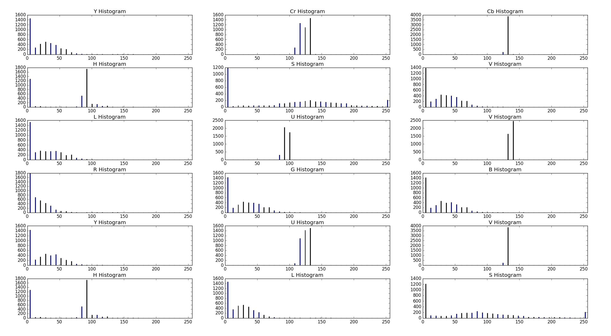

# Vehicle Tracking
Udacity Self Driving Nanodegree - Vehicle Tracking project

**The goals**

- Perform a Histogram of Oriented Gradients (HOG) feature extraction on a labeled training set of images and train a classifier Linear SVM classifier
- Optionally, you can also apply a color transform and append binned color features, as well as histograms of color, to your HOG feature vector.
- Implement a sliding-window technique and use your trained classifier to search for vehicles in images.
- Run your pipeline on a video stream and create a heat map of recurring detections frame by frame to reject outliers and follow detected vehicles.
- Estimate a bounding box for vehicles detected.

## Datasets

|Label | Link|
|----- |---- |
|Vehicles | https://s3.amazonaws.com/udacity-sdc/Vehicle_Tracking/vehicles.zip |
|Non vehicles | https://s3.amazonaws.com/udacity-sdc/Vehicle_Tracking/non-vehicles.zip |
|Annotated data from Udacity Self-driving car repo [by Autti] | http://bit.ly/udacity-annotations-autti |

More datasets:
https://github.com/udacity/self-driving-car/tree/master/annotations

## Colorspaces and histograms

Car

Non-car

## HOG

### Choosing parameters

### Training

## Sliding-window technique

### Scales and overlap

### Examples

### False positives minimization

## Tracking in video

**Time/number of detections plot**

### Filtering false positives

### Heat map

## Discussion
